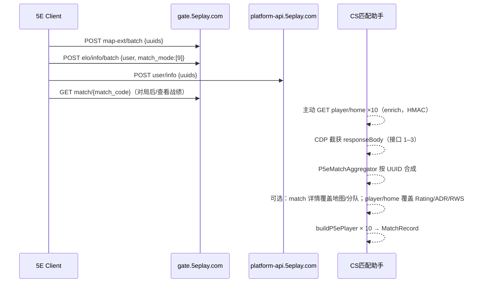

# 5E 对战平台 — 匹配相关接口响应说明

> 文档版本：基于 2026-06-16 实采样本整理  
> 用途：人工校对字段含义、指导 `src/platforms/5e/field-mapper.ts` 等后续开发  
> 样本场景：10 人房间，`match_mode = 9`（优先排位 / 当前赛季模式）

---

## 1. 总览

进入 5E 房间并打开对阵界面时，客户端会**批量**请求玩家数据；匹配 enrich 阶段会主动拉取接口 4（地图/分队）与接口 7（玩家主页 season_data）。CDP 白名单监听接口 1–3。

| 序号 | 用途 | 方法 | 完整 URL（样本） | 白名单匹配 |
|------|------|------|------------------|------------|
| 1 | 玩家地图扩展统计 | POST | `https://gate.5eplay.com/cranenew/http/api/data/player/map-ext/batch` | `/player/map-ext/batch` |
| 2 | 玩家 ELO / 赛季信息 | POST | `https://gate.5eplay.com/cranenew/http/api/data/player/elo/info/batch` | `/player/elo/info/batch` |
| 3 | 玩家基本信息 | POST | `https://platform-api.5eplay.com/api/user/info` | `/api/user/info` |
| 4 | **单场对局详情** | GET | `https://gate.5eplay.com/crane/http/api/data/match/{match_code}` | `/api/data/match/`（主动拉取） |
| 5 | ~~玩家赛季统计~~ | GET | `https://gate.5eplay.com/cranenew/http/api/data/player/season` | **已弃用**（需 Cookie；应用不再调用） |
| 6 | **Rating 折线图** | GET | `https://gate.5eplay.com/cranenew/http/api/data/chart/curve` | 辅助 |
| 7 | **玩家主页** | GET | `https://gate.5eplay.com/cranenew/http/api/data/v3/player/home?uuid={uuid}` | 主动拉取（HMAC 签名，无需登录） |

> 注意：接口 1–3 路径前缀多为 `cranenew`；接口 4 为 `crane`（无 `new`）。

### 1.1 关联键

- 接口 1–3 以 **玩家 UUID**（形如 `76af4325-dd04-11ed-9ce2-ec0d9a495494`）为关联键。
- 接口 4 以 **match_code**（形如 `g161-20260614142743982331607`）为路径参数；响应内再用 **uid**（数字）与 **uuid** 关联玩家。
- 一次房间合成（接口 1–3）：**同一批 10 个 UUID** 的三份响应到齐（见 `P5eMatchAggregator`）。
- **match_code 来源**：接口 2 的 `specialData.match_data[].match_id`（非空字符串）；或接口 4 请求 URL 路径段。
- 接口 1、3 请求体字段名为 `uuids`；接口 2 为 `user`（值同为 UUID 列表）。

### 1.2 响应包裹层差异

| 字段 | map-ext / elo batch / **match** | user/info |
|------|----------------------------------|-----------|
| 成功标志 | `code: 0`, `success: true`, `status: true` | `code: 0`, `msg: "success"` |
| 消息字段 | `message` | `msg` |
| 业务数据 | `data` | `data` |
| 时间戳 | `timestamp`（秒） | `timestamp`（秒） |
| 追踪 | `trace_id` | 无 |
| 扩展 | `ext: []` | 无 |
| 错误码 | `errcode: 0` | 无 |

### 1.3 头像 CDN

`avatar_url` 多为相对路径，需拼接：

```text
https://oss-arena.5eplay.com/{avatar_url}
```

示例：

- `disguise/images/eb/8f/eb8fb22d12271d2c0416d267942014a7.jpg`
- `avatar/default_1.png`
- `images/award/f8f5b1f7c38e04db29e843466c9b7f89.jpg`

---

## 2. 接口一：批量查询玩家地图数据（map-ext/batch）

### 2.1 请求

```http
POST /cranenew/http/api/data/player/map-ext/batch
Host: gate.5eplay.com
Content-Type: application/json
```

**Body**

| 字段 | 类型 | 必填 | 说明 |
|------|------|------|------|
| `uuids` | `string[]` | 是 | 房间内玩家 UUID 列表 |

样本：

```json
{
  "uuids": [
    "76af4325-dd04-11ed-9ce2-ec0d9a495494",
    "fd023f9a-efda-11f0-a93a-0c42a164bc3c"
  ]
}
```

### 2.2 响应包裹层

| 字段 | 类型 | 样本值 | 说明 |
|------|------|--------|------|
| `data` | `object` | — | 见 §2.3 |
| `code` | `number` | `0` | 业务码，`0` 为成功 |
| `message` | `string` | `"操作成功"` | 人类可读消息 |
| `status` | `boolean` | `true` | 请求状态 |
| `timestamp` | `number` | `1781593342` | Unix 秒级时间戳 |
| `ext` | `array` | `[]` | 扩展位，样本为空数组 |
| `trace_id` | `string` | `"e8ff3410…"` | 链路追踪 ID |
| `success` | `boolean` | `true` | 是否成功 |
| `errcode` | `number` | `0` | 错误码 |

### 2.3 `data` 结构

```text
data: Record<uuid, Record<mapKey, MapStatEntry>>
```

- 第一层 key：玩家 UUID
- 第二层 key：地图内部名（见 §2.4）
- value：该玩家在该地图上的统计数据

### 2.4 地图 key 枚举（样本中出现的全部）

| mapKey | 常见显示名 |
|--------|------------|
| `de_ancient` | Ancient |
| `de_anubis` | Anubis |
| `de_cache` | Cache |
| `de_dust2` | Dust2 |
| `de_inferno` | Inferno |
| `de_mills` | Mills |
| `de_mirage` | Mirage |
| `de_nuke` | Nuke |
| `de_overpass` | Overpass |
| `de_thera` | Thera |
| `de_train` | Train |
| `de_vertigo` | Vertigo |

### 2.5 `MapStatEntry` 字段（单地图单玩家）

| 字段 | 类型 | 样本 | 说明 |
|------|------|------|------|
| `matchTotal` | `string` | `"572"` | 该地图总场次（字符串数字） |
| `winTotal` | `string` | `"264"` | 该地图胜场 |
| `perWin` | `number` | `0.46` | 地图胜率（0–1 浮点） |
| `level` | `string` | `"60"` | 地图熟练度等级 |
| `dexterity` | `string` | `"2926"` | 地图熟练度经验值 |
| `rws` | `number` | `8.8` | 地图 RWS 均值 |
| `adr` | `number` | `73.72` | 地图 ADR 均值 |
| `rating` | `number` | `0.93` | 地图 Rating |
| `recentPerWin` | `number` | `0.3` | 近期该地图胜率 |
| `process` | `string` | `"97"` | 升级进度百分比（推测） |
| `nextLevelDexterity` | `string` | `"3000"` | 下一等级所需熟练度 |

**零场地图**：`matchTotal` 为 `"0"` 时，多数数值字段为 `0` 或 `"0"`。

### 2.6 当前应用映射（`field-mapper.ts`）

| UI / `MatchPlayer` | 来源字段 | 备注 |
|--------------------|----------|------|
| `seasonRating`（优先） | **接口 5** `contrast_data.rating` | 对齐游戏数据中心「赛季 Rating」 |
| `adpr` / `weRaw`（优先） | **接口 5** `contrast_data.adr` / `rws` | 赛季 ADR / RWS |
| `seasonTotalNum` / `seasonWinRate` | **接口 5** `match_total` / `per_win_match` | 回退 `elo.modes.9` |
| `rating`（近期） | **接口 5** `rating_data` 近 10 场均 | 不是 map-ext 生涯 |
| `mapWinRate` / `mapTotalNum`（优先） | **接口 5** `match_map_data[当前地图]` | 本赛季本图，非生涯 |
| `rating` / `adpr` / `weRaw`（回退） | map-ext 当前地图 | 仅无 season 数据时 |
| `mapWinRate` 等（回退） | map-ext | 生涯地图统计 |
| 对局地图推断 | 多数玩家 `matchTotal > 0` 的地图投票 | **应改用接口 4 `main.map`** |

**未使用（map-ext）**：`level`, `dexterity`, `process`, `nextLevelDexterity`（仍可用于 tags）

---

## 3. 接口二：批量查询玩家 ELO 信息（elo/info/batch）

### 3.1 请求

```http
POST /cranenew/http/api/data/player/elo/info/batch
Host: gate.5eplay.com
Content-Type: application/json
```

**Body**

| 字段 | 类型 | 必填 | 说明 |
|------|------|------|------|
| `user` | `string[]` | 是 | 玩家 UUID 列表（注意不是 `uuids`） |
| `match_mode` | `number[]` | 是 | 模式 ID 列表；样本为 `[9]` |

样本：

```json
{
  "user": ["76af4325-dd04-11ed-9ce2-ec0d9a495494"],
  "match_mode": [9]
}
```

### 3.2 响应包裹层

与 §2.2 相同（`message` / `trace_id` / `success` / `errcode` 等）。

### 3.3 `data` 结构

```text
data: Record<uuid, { modes: Record<modeId, ModeEntry> }>
```

- `modeId` 为字符串 key，样本均为 `"9"`。
- `match_mode: [9]` 一般对应 **优先排位 / 当前赛季主模式**（待产品确认显示名）。

### 3.4 `ModeEntry` 字段

| 字段 | 类型 | 样本 | 说明 |
|------|------|------|------|
| `uid` | `number` | `14729071` | 5E 内部数字 UID |
| `elo` | `number` | `1751.1` | **当前 ELO 分**（主显示分） |
| `matchTotal` | `number` | `9` | 本赛季该模式已打场次 |
| `matchStatus` | `number` | `0` / `2` / `3` | 匹配/定级状态（见 §3.6） |
| `levelId` | `number` | `46` / `0` | 段位等级 ID，`0` 可能表示未定级 |
| `rank` | `number` | `518139` | 全服排名 |
| `seasonElo` | `number` | `1550` | 赛季初始 / 基准 ELO |
| `specialData` | `string` | JSON 字符串 | 见 §3.5 |
| `season` | `string` | `"2026s3"` | 赛季标识 |
| `maxElo` | `number` | `1836.95` | 本赛季该模式最高 ELO |
| `maxLevelId` | `number` | `0` | 赛季最高段位 ID，样本均为 `0` |
| `LevelVersion` | `number` | `2` | 段位体系版本 |
| `star_num` | `number` | `0` | 星级（样本均为 0） |
| `dragon_flag` | `number` | `0` | 龙标/特殊标记（样本均为 0） |

### 3.5 `specialData` 解析（JSON 字符串）

整体为 JSON，常见顶层 key：

#### 3.5.1 `match_data` — 最近对局摘要

`array`，每项：

| 字段 | 类型 | 样本 | 说明 |
|------|------|------|------|
| `is_win` | `number` | `-1` / `0` / `1` | `-1` 负，`0` 平/无效，`1` 胜 |
| `match_id` | `string` | `"g161-20260614142743982331607"` 或 `""` | 对局 ID，空串表示占位 |
| `match_status` | `number` | `0` / `2` | 对局状态（含义待确认） |
| `change_elo` | `number` | `88.03` / `-84.93` / `0` | 该场 ELO 变化 |

**应用逻辑**：仅当 `match_id` 非空时计入 `recentResults` / `recentRatings`。

#### 3.5.2 `star_2026` — 赛季星级

| 字段 | 类型 | 说明 |
|------|------|------|
| `change_small_star_num` | `number` | 小星变化 |
| `origin_small_star_num` | `number` | 原小星数 |
| `change_type` | `number` | 变化类型 |
| `now_small_star_num` | `number` | 当前小星数 |

#### 3.5.3 `promotion_data`

| 字段 | 类型 | 样本 | 说明 |
|------|------|------|------|
| `promotion_data` | `number[]` | `[45]` | 晋级相关数据，含义待确认 |

### 3.6 `matchStatus` 观测值（待人工确认）

| 值 | 样本中出现场景 |
|----|----------------|
| `0` | 正常已开局数 > 0 |
| `2` | 有 `match_data` 且 `match_status: 2` 的条目 |
| `3` | `matchTotal: 0`，可能为定级中/未开打 |

### 3.7 当前应用映射

| UI / `MatchPlayer` | 来源字段 | 备注 |
|--------------------|----------|------|
| `score` | `modes["9"].elo` | 回退 `user.csgo_elo_9` |
| `seasonTotalNum` | `matchTotal` | 回退 `user.csgo_match_count_9` |
| `recentResults` | `specialData.match_data` | 由 `is_win` 转换 |
| `recentRatings` | `specialData.match_data[].change_elo` | |
| `recentWinRate` | 由 `recentResults` 计算 | |
| `latest10WinNum` / `latest10TotalNum` | `match_data` 有效条目 | |
| `continuedWins` | 从最近结果向前连赢 | |
| `recentDrawCount` | `is_win === 0` 且有效 match | |
| `rankDesc` / `tags` | `season`, `levelId`, `rank`, `maxElo` | |

**未使用**：`uid`, `seasonElo`, `matchStatus`, `maxLevelId`, `LevelVersion`, `star_num`, `dragon_flag`, `star_2026`, `promotion_data`

---

## 4. 接口三：批量查询玩家基本信息（user/info）

### 4.1 请求

```http
POST /api/user/info
Host: platform-api.5eplay.com
Content-Type: application/json
```

**Body**

| 字段 | 类型 | 必填 | 说明 |
|------|------|------|------|
| `uuids` | `string[]` | 是 | 玩家 UUID 列表 |

### 4.2 响应包裹层

| 字段 | 类型 | 样本值 | 说明 |
|------|------|--------|------|
| `code` | `number` | `0` | 业务码 |
| `msg` | `string` | `"success"` | 注意：不是 `message` |
| `data` | `object` | — | 见 §4.3 |
| `timestamp` | `number` | `1781594817` | Unix 秒 |

### 4.3 `data` 结构

```text
data: Record<uuid, UserInfoEntry>
```

### 4.4 `UserInfoEntry` 全字段

| 字段 | 类型 | 样本 | 说明 |
|------|------|------|------|
| `uuid` | `string` | `"76af4325-…"` | 玩家 UUID |
| `username` | `string` | `"Naffri"` | **昵称**（主显示名） |
| `user_event_name` | `string` | `""` | 赛事用名 |
| `domain` | `string` | `"naffri"` | 个人域名 slug |
| `country_id` | `string` | `""` / `"mo"` | 国家/地区代码 |
| `steam_id` | `string` | `"76561198435211670"` | Steam64 |
| `avatar_url` | `string` | `"avatar/default_1.png"` | 头像相对路径 |
| `room_id` | `number` | `0` | 当前房间 ID |
| `csgo_match_count_9` | `number` | `9` | 模式 9 总场次 |
| `csgo_match_count_8` | `number` | `0` | 模式 8 总场次 |
| `csgo_match_count` | `number` | `0` | 通用场次计数 |
| `csgo_elo_8` | `number` | `500` | 模式 8 ELO |
| `csgo_elo_9` | `number` | `1751.1` | 模式 9 ELO（可与 elo 接口互证） |
| `csgo_elo_4` | `number` | `3000` | 模式 4 ELO |
| `csgo_elo_6` | `number` | `2700` | 模式 6 ELO |
| `csgo_elo` | `number` | `500` | 默认/综合 ELO |
| `csgo_rating` | `number` | `0` / `0.45` | 账号级 Rating，常为 0 |
| `card_badge` | `string` | `""` | 名片徽章 |
| `dress_room_card_id` | `number` | `0` / `1500` | 房间卡装扮 ID |
| `dress_card_id` | `number` | `0` / `1334` | 名片装扮 ID |
| `dress_box_id` | `number` | `0` / `190` | 头像框 ID |
| `room_bg_id` | `number` | `0` / `1336` | 房间背景 ID |
| `item_dummy_status` | `number` | `0` | 道具占位状态 |
| `item_dummy_name` | `string` | `""` | 道具占位名 |
| `vip_level` | `number` | `0` / `5` / `6` | VIP 等级 |
| `vip_grade` | `number` | `1` | VIP 档位 |
| `credit_score` | `number` | `100000` | 信用分（满分常见 100000） |
| `training_expire` | `number` | `0` | 训练模式过期时间 |
| `priority_expire` | `number` | `0` / Unix 秒 | 优先匹配权益过期 |
| `priority_verify_type` | `number` | `0` | 优先验证类型 |
| `priority_banned_time` | `number` | `0` | 优先封禁截止 |
| `login_banned_time` | `number` | `0` | 登录封禁截止 |
| `flag_status_1` | `string` | `"128"` | 状态位标志 |
| `flag_csgo` | `string` | `"395"` | CSGO 相关标志 |
| `flag_honor` | `string` | `"65548"` | 荣誉标志 |
| `account_status` | `number` | `0` | 账号状态 |
| `describe_verify_check_ignore` | `number` | `0` | 实名验证跳过 |
| `describe_verify_status` | `number` | `0` / `1` | 实名状态 |
| `disguise_data` | `null` | `null` | 伪装/匿名数据 |
| `special_data` | `string` | `""` 或 JSON 字符串 | 见 §4.5 |
| `csgo_map_data` | `null` / `array` | `null` / `[]` | 地图数据（本流程以 map-ext 为准） |
| `advanced_identity_status` | `number` | `0` | 高级认证状态 |
| `advanced_identity_desc` | `null` | `null` | 高级认证描述 |
| `achievement` | `number[]` | `[131928, …]` | 成就 ID 列表 |
| `backpack_per` | `number` | `1` | 背包权限相关 |
| `guild_name` | `string` | `""` / `"魔都俱乐部"` | 公会名 |
| `guild_title` | `string` | `""` / `"精英"` | 公会头衔 |
| `guild_role` | `number` | `0` / `3` | 公会角色 |
| `identity_list` | `null` | `null` | 身份列表 |
| `is_plus` | `number` | `1` | **可选**，Plus 会员（仅部分用户） |
| `plus_icon` | `string` | `"images/act/…"` | **可选**，Plus 图标 |
| `plus_icon_short` | `string` | `"images/act/…"` | **可选**，Plus 短图标 |

### 4.5 `special_data`（user/info 内，JSON 字符串）

当非空时，结构示例：

```json
{
  "csgo_level_id_8": {
    "level_id": 0,
    "record": "",
    "match_status": 0,
    "rank": 0,
    "losing_streak": 0,
    "rating": 0,
    "rws": 0,
    "adr": 0,
    "match_total": "0"
  },
  "csgo_level_id_9": {
    "level_id": "11",
    "record": "",
    "match_status": "0",
    "rank": "0",
    "losing_streak": "3",
    "rating": "1.01",
    "rws": "10.92",
    "adr": "83.96"
  }
}
```

**注意**：`csgo_level_id_9` 内多数字段为**字符串**，与 map-ext 的浮点类型不同。

| 子字段 | 类型 | 说明 |
|--------|------|------|
| `level_id` | `number` / `string` | 段位 ID |
| `record` | `string` | 战绩记录串 |
| `match_status` | `number` / `string` | 匹配状态 |
| `rank` | `number` / `string` | 排名 |
| `losing_streak` | `number` / `string` | 连败场次 |
| `rating` | `number` / `string` | Rating |
| `rws` | `number` / `string` | RWS |
| `adr` | `number` / `string` | ADR |
| `match_total` | `string` | 仅 `_8` 分支出现 |

### 4.6 当前应用映射

| UI / `MatchPlayer` | 来源字段 | 备注 |
|--------------------|----------|------|
| `nickname` | `username` | |
| `avatar` | `avatar_url` + CDN | |
| `steamId` | `steam_id` | |
| `isVip` | `vip_grade` 真值 | 可能应改为 `vip_level > 0` |
| `score`（回退） | `csgo_elo_9` → `csgo_elo` | 优先 elo 接口 |
| `rating` / `seasonRating`（回退） | `csgo_rating`（>0 时） | 优先 map-ext |
| `seasonTotalNum`（回退） | `csgo_match_count_9` | |
| `tags` | `credit_score` 低分等 | |

**未使用但可能有价值**：`special_data.csgo_level_id_9`（rating/rws/adr/losing_streak）、`guild_*`、`priority_expire`、`is_plus`、`achievement`

---

## 5. 接口四：单场对局详情（match/{match_code}）

> **核心价值**：无需推测地图与分队；提供当局 Rating/ADR/RWS/KD、回合比分、双方 uid 列表。  
> 样本对局：`g161-20260614142743982331607`，地图 `de_dust2`（炙热沙城2），比分 13:10，共 23 回合。

### 5.1 请求

```http
GET /crane/http/api/data/match/{match_code}
Host: gate.5eplay.com
Referer: https://view-arena.5eplay.com/
```

**路径参数**

| 参数 | 类型 | 样本 | 说明 |
|------|------|------|------|
| `match_code` | `string` | `g161-20260614142743982331607` | 对局唯一码；前缀多为 `g161-` 或 `g161-n-` |

**curl 示例**

```bash
curl.exe -s "https://gate.5eplay.com/crane/http/api/data/match/g161-20260614142743982331607" \
  -H "Referer: https://view-arena.5eplay.com/"
```

无需 Authorization（样本可匿名 GET）；若后续 5E 加签，以实采为准。

### 5.2 响应包裹层

与 §2.2 相同（`message` / `trace_id` / `success` / `errcode` 等）。

### 5.3 `data` 顶层结构

| 字段 | 类型 | 样本 | 说明 |
|------|------|------|------|
| `has_side_data_and_rating2` | `boolean` | `true` | 是否含分边数据与 rating2 |
| `main` | `object` | — | 对局主信息，见 §5.4 |
| `group_1` | `array` | 长度 5 | **队伍 1** 玩家详情列表 |
| `group_2` | `array` | 长度 5 | **队伍 2** 玩家详情列表 |
| `level_list` | `null` | `null` | 段位列表（样本为空） |
| `room_card` | `object` | — | 房间卡道具，见 §5.10 |
| `round_sfui_type` | `string[]` | 长度 = 回合数 | 每回合 UI 结果类型，见 §5.11 |
| `user_stats` | `object` | — | 见 §5.12 |
| `group_1_team_info` | `object` | — | 队伍 1 战队信息，见 §5.13 |
| `group_2_team_info` | `object` | — | 队伍 2 战队信息 |
| `treat_info` | `null` | `null` | 治疗/特殊信息（样本为空） |
| `season_type` | `number` | `0` | 赛季类型 |

### 5.4 `main` — 对局主信息

| 字段 | 类型 | 样本 | 说明 |
|------|------|------|------|
| `id` | `number` | `314345338` | 对局内部 ID |
| `match_code` | `string` | `g161-20260614142743982331607` | 对局码 |
| `map` | `string` | `de_dust2` | **地图内部名**（权威） |
| `map_desc` | `string` | `炙热沙城2` | 地图中文名 |
| `match_mode` | `number` | `9` | 匹配模式（与 elo 的 mode 9 对应） |
| `game_mode` | `number` | `24` | 游戏子模式 |
| `game_name` | `string` | `nspug_c` | 游戏模式代号 |
| `season` | `string` | `2026s3` | 赛季 |
| `year` | `number` | `2026` | 年份 |
| `round_total` | `number` | `23` | 总回合数 |
| `start_time` | `number` | `1781418601` | 开始时间（Unix 秒） |
| `end_time` | `number` | `1781420942` | 结束时间（Unix 秒） |
| `status` | `number` | `1` | 对局状态 |
| `match_winner` | `number` | `1` | 获胜方：`1` = group_1，`2` = group_2 |
| `group1_all_score` | `number` | `13` | 队伍 1 总比分 |
| `group2_all_score` | `number` | `10` | 队伍 2 总比分 |
| `group1_fh_score` | `number` | `5` | 队伍 1 上半场比分 |
| `group1_sh_score` | `number` | `8` | 队伍 1 下半场比分 |
| `group2_fh_score` | `number` | `7` | 队伍 2 上半场比分 |
| `group2_sh_score` | `number` | `3` | 队伍 2 下半场比分 |
| `group1_fh_role` | `number` | `1` | 队伍 1 上半场阵营角色 |
| `group1_sh_role` | `number` | `0` | 队伍 1 下半场阵营角色 |
| `group2_fh_role` | `number` | `0` | 队伍 2 上半场阵营角色 |
| `group2_sh_role` | `number` | `1` | 队伍 2 下半场阵营角色 |
| `group1_origin_elo` | `number` | `1736.2` | 队伍 1 赛前均 ELO |
| `group2_origin_elo` | `number` | `1735.89` | 队伍 2 赛前均 ELO |
| `group1_change_elo` | `number` | `0` | 队伍 1 ELO 变化（样本为 0） |
| `group2_change_elo` | `number` | `0` | 队伍 2 ELO 变化 |
| `group1_uids` | `string` | `"19554457,24904949,…"` | 队伍 1 五人 **数字 uid**，逗号分隔 |
| `group2_uids` | `string` | `"24634974,20060703,…"` | 队伍 2 五人 uid |
| `group1_tid` | `number` | `0` | 队伍 1 战队 ID |
| `group2_tid` | `number` | `0` | 队伍 2 战队 ID |
| `mvp_uid` | `number` | `16435782` | 本场 MVP 的 uid |
| `most_1v2_uid` | `number` | `16435782` | 最多 1v2 的 uid |
| `most_assist_uid` | `number` | `21278209` | 最多助攻的 uid |
| `most_awp_uid` | `number` | `16435782` | 最多 AWP 击杀的 uid |
| `most_end_uid` | `number` | `22131118` | 最多残局胜利的 uid |
| `most_first_kill_uid` | `number` | `21278209` | 最多首杀的 uid |
| `most_headshot_uid` | `number` | `19554457` | 最多爆头的 uid |
| `most_jump_uid` | `number` | `0` | 最多跳跃（样本为 0） |
| `knife_winner` | `number` | `0` | 刀局赢家 uid |
| `knife_winner_role` | `number` | `0` | 刀局赢家阵营 |
| `demo_url` | `string` | `https://sh-t-demo.5eplaycdn.com/pug/…` | Demo 下载 ZIP |
| `location` | `string` | `hz` | 服务器区域简码 |
| `location_full` | `string` | `sh_pug-high_tencent` | 完整服务器标识 |
| `server_ip` | `string` | `""` | 服务器 IP（样本为空） |
| `server_port` | `string` | `"27015"` | 服务器端口 |
| `waiver` | `number` | `0` | 弃权标记 |
| `cs_type` | `number` | `0` | CS 版本类型 |
| `priority_show_type` | `number` | `3` | 优先展示类型 |
| `pug10m_show_type` | `number` | `0` | PUG 10 人展示类型 |
| `credit_match_status` | `number` | `1` | 信用对局状态 |

### 5.5 `group_1` / `group_2` — `PlayerMatchEntry`

每队 5 人，每项结构相同：

| 字段 | 类型 | 说明 |
|------|------|------|
| `fight` | `object` | **全场**战斗统计（§5.6） |
| `fight_t` | `object` | T 边统计（结构同 `fight`） |
| `fight_ct` | `object` | CT 边统计（结构同 `fight`） |
| `sts` | `object` | 本场 ELO/段位变化（§5.7） |
| `level_info` | `object` | 段位详情（§5.8） |
| `user_info` | `object` | 用户资料（§5.9） |
| `friend_relation` | `number` | 好友关系：`0` 非好友 |

**分队**：`group_1` → `teamSide = 1`，`group_2` → `teamSide = 2`。

### 5.6 `fight` / `fight_t` / `fight_ct` — 战斗统计

> 样本中多数数值为 **字符串**。

| 字段 | 类型 | 说明 |
|------|------|------|
| `id` | `string` | 战绩记录 ID |
| `uid` | `string` | 玩家数字 uid |
| `match_code` | `string` | 对局码 |
| `map` | `string` | 地图 |
| `match_mode` | `string` | 模式 |
| `game_mode` | `string` | 子模式 |
| `group_id` | `string` | `"1"` / `"2"` 队伍编号 |
| `season` | `string` | 赛季 |
| `year` | `string` | 年份 |
| `day` | `string` | 日期 YYYYMMDD |
| `match_time` | `string` | 对局时间戳 |
| `round_total` | `string` | 回合数 |
| `is_win` | `string` | `"1"` 胜 / `"0"` 负 |
| `is_tie` | `string` | 是否平局 |
| `kill` | `string` | 击杀 |
| `death` | `string` | 死亡 |
| `assist` | `string` | 助攻 |
| `adr` | `string` | 场均伤害 |
| `rating` | `string` / `number` | Rating |
| `rating2` | `string` / `number` | Rating2 |
| `rating3` | `string` / `number` | Rating3 |
| `rws` | `string` / `number` | RWS |
| `kast` | `string` / `number` | KAST |
| `headshot` | `string` | 爆头数 |
| `per_headshot` | `string` / `number` | 爆头率 |
| `awp_kill` | `string` | AWP 击杀 |
| `first_kill` | `string` | 首杀次数 |
| `first_death` | `string` | 首死次数 |
| `end_1v1` ~ `end_1v5` | `string` | 残局胜场（1v1–1v5） |
| `kill_1` ~ `kill_5` | `string` | 多杀回合数 |
| `perfect_kill` | `string` | 完美击杀 |
| `assisted_kill` | `string` | 助攻击杀 |
| `benefit_kill` | `string` | 受益击杀 |
| `revenge_kill` | `string` | 复仇击杀 |
| `team_kill` | `string` | 队友误杀 |
| `defused_bomb` | `string` | 拆包次数 |
| `explode_bomb` | `string` | 爆炸获胜次数 |
| `planted_bomb` | `string` | 下包次数 |
| `flash_enemy` | `string` | 闪到敌人次数 |
| `flash_enemy_time` | `string` | 敌人被闪总时长 |
| `flash_team` | `string` | 闪到队友次数 |
| `flash_team_time` | `string` | 队友被闪总时长 |
| `flash_time` | `string` | 有效闪光时长 |
| `throw_harm` | `string` | 投掷物总伤害 |
| `throw_harm_enemy` | `string` | 对敌投掷伤害 |
| `jump_total` | `string` | 跳跃次数 |
| `hold_total` | `string` | 架枪次数 |
| `many_assists_cnt1` ~ `cnt5` | `string` | 多助攻统计 |
| `match_team_id` | `string` | 战队 ID |
| `is_mvp` | `string` | MVP 标记 |
| `is_svp` | `string` | 败方 SVP |
| `is_highlight` | `string` | 高光局 |
| `is_most_1v2` | `string` | 是否最多 1v2 |
| `is_most_assist` | `string` | 是否最多助攻 |
| `is_most_awp` | `string` | 是否最多 AWP |
| `is_most_end` | `string` | 是否最多残局 |
| `is_most_first_kill` | `string` | 是否最多首杀 |
| `is_most_headshot` | `string` | 是否最多爆头 |
| `is_most_jump` | `string` | 是否最多跳跃 |

**推荐 UI 映射（当局）**：`fight.rating` → Rating；`fight.adr` → ADPR；`fight.rws` → WE；`kill/death` → KD；`per_headshot` → 爆头率。

### 5.7 `sts` — 本场 ELO/段位变化

| 字段 | 类型 | 说明 |
|------|------|------|
| `id` | `string` | 记录 ID |
| `uid` | `string` | 玩家 uid |
| `match_code` | `string` | 对局码 |
| `match_mode` | `string` | 模式 |
| `season` | `string` | 赛季 |
| `origin_elo` | `string` | 赛前 ELO |
| `change_elo` | `string` | **本场 ELO 变化** |
| `level_id` | `string` | 赛后段位 ID |
| `origin_level_id` | `number` | 赛前段位 ID |
| `origin_match_total` | `string` | 赛前赛季场次 |
| `match_status` | `string` | 定级/匹配状态 |
| `match_flag` | `string` | 对局标记 |
| `rank` | `string` | 赛后排名 |
| `origin_rank` | `string` | 赛前排名 |
| `change_rank` | `number` | 排名变化量 |
| `rank_change_type` | `number` | 排名变化类型 |
| `placement` | `string` | 定级赛标记 |
| `punishment` | `string` | 惩罚标记 |
| `star_num` | `number` | 当前星级 |
| `origin_star_num` | `number` | 原星级 |
| `data_tips_detail` | `number` | 数据提示 |
| `challenge_status` | `number` | 挑战状态 |
| `map_reward_status` | `number` | 地图奖励状态 |
| `special_data` | `string` | JSON，结构同 §3.5 |

### 5.8 `level_info` — 段位详情

| 字段 | 类型 | 说明 |
|------|------|------|
| `level_id` | `number` | 当前段位 ID |
| `level_name` | `string` | 段位名 |
| `level_type` | `number` | 段位类型 |
| `origin_level_id` | `number` | 赛前段位 ID |
| `origin_match_total` | `number` | 赛前场次 |
| `origin_elo` | `string` | 赛前 ELO |
| `change_elo` | `string` | ELO 变化 |
| `level_elo` | `number` | 段位 ELO |
| `max_level` | `number` | 最高段位 |
| `star_num` | `number` | 星级 |
| `origin_star_num` | `number` | 原星级 |
| `dragon_flag` | `number` | 龙标 |
| `match_status` | `string` | 匹配状态 |
| `match_flag` | `string` | 对局标记 |
| `rank` | `string` | 排名 |
| `origin_rank` | `string` | 原排名 |
| `trigger_promotion` | `number` | 触发晋级 |
| `special_bo` | `number` | 特殊 BO |
| `rise_type` | `number` | 上升类型 |
| `tie_status` | `number` | 平局状态 |
| `deduct_data` | `object` | `{ all_deduct_elo, deduct_remain_elo, deduct_elo }` |
| `star_info` | `object` | `{ change_small_star_num, origin_small_star_num, change_type, now_small_star_num, stars_to_next_segment }` |
| `special_data` | `array` / `null` | `match_data` 条目数组，或 `null` |

### 5.9 `user_info` — 对局内用户资料

| 字段 | 类型 | 说明 |
|------|------|------|
| `user_data` | `object` | 主用户数据（含 `uuid`、`username`、`profile`、`steam` 等） |
| `plus_info` | `object` | `{ is_plus, plus_icon, plus_icon_short, vip_level, plus_grade, growth_score }` |
| `user_avatar_frame` | `null` | 头像框 |

**`user_data` 主要子结构**

| 路径 | 说明 |
|------|------|
| `user_data.uid` | 数字 uid |
| `user_data.uuid` | UUID（与接口 1–3 关联） |
| `user_data.username` | 昵称 |
| `user_data.profile.avatarUrl` | 头像（**驼峰**，非 `avatar_url`） |
| `user_data.steam.steamId` | Steam64 |
| `user_data.trusted.score` | 信用分 |
| `user_data.status.csgoFrozenReason` | 冻结原因（如 `Disconnect`） |

### 5.10 `room_card`

`id`, `category`, `describe`, `name`, `propTemplateId`, `getWay`, `onShelf`, `shelfAt`, `getButton`, `getUrl`, `attrs`, `displayStatus`, `sysType`, `createdAt`, `updatedAt`

### 5.11 `round_sfui_type`

`string[]`，长度 = `main.round_total`。每项为回合结束 UI 类型码（如 `"1"`/`"2"`/`"4"`/`"5"`），枚举待对照客户端。

### 5.12 `user_stats`

`map_level.{ map_exp, add_exp }`，`plat_level.{ plat_level_exp, add_exp }`

### 5.13 `group_N_team_info`

`team_id`, `team_name`, `logo_url`, `team_domain`, `team_tag`

### 5.14 uid / uuid 对照（样本对局）

| group | username | uid | uuid |
|-------|----------|-----|------|
| 1 | 我爱抽双中支 | 16435782 | 4b8a7ceb-6f4a-11ee-9ce2-ec0d9a495494 |
| 1 | 涵涵大猪 | 24904949 | b6ed6c15-7089-11f0-a93a-0c42a164bc3c |
| 1 | 用户08066VhNDKXB | 19554457 | b6c90410-53b8-11ef-ac9f-ec0d9a7185e0 |
| 1 | 許春风丶 | 15320070 | 4409a79d-0cfd-11ee-9ce2-ec0d9a495494 |
| 1 | 引水恒流谓稻浓 | 22131118 | 83a36106-dadc-11ef-848e-506b4bfa3106 |
| 2 | 翻斗花园牛叶爷 | 20060703 | b27183c1-6f32-11ef-ac9f-ec0d9a7185e0 |
| 2 | 阔乐不加冰y | 21278209 | aa1b4d9a-b178-11ef-848e-506b4bfa3106 |
| 2 | 用户071443OlHIy7 | 24634974 | 914a7043-6098-11f0-a93a-0c42a164bc3c |
| 2 | 小宇y1y | 27986408 | 731007f4-56a5-11f1-bfd6-043f72fd82b0 |
| 2 | 下次丶换你爱我 | 16874361 | 40915f47-ac81-11ee-9ce2-ec0d9a495494 |

### 5.15 与接口 1–3 的衔接（规划）

1. 房间阶段：接口 1–3 凑齐 10 人 UUID 与赛季统计。
2. 从接口 2 `specialData.match_data` 提取最近非空 `match_id` → `match_code`。
3. GET 接口 4：`main.map` 覆盖地图推断；`group_1`/`group_2` 覆盖分队。
4. 合并：接口 5 提供赛季 Rating/ADR/RWS；接口 4 `fight.*` 仅作当局 K/D 等；map-ext 作回退。

### 5.16 当前应用状态

| 项 | 状态 |
|----|------|
| CDP 白名单 | 接口 1–3；接口 4/5 为主动拉取 |
| 地图 / 分队 | match detail 可用时覆盖推断 |
| season Rating | **已接入** `player/home` enrich（`season_data`） |

---

## 6. 接口五：玩家赛季统计（player/season）— 已弃用

> **应用已不再调用此接口**（需 5E 登录 Cookie + CDP）。游戏内「数据中心」主页数据现由 **接口 7 `v3/player/home`** 的 `season_data` 提供。

### 6.1 请求（历史参考）

```http
GET /cranenew/http/api/data/player/season?match_type=9&season=2026s3&uuid={uuid}&year=2026&cs_type=0
Host: gate.5eplay.com
```

| 参数 | 类型 | 说明 |
|------|------|------|
| `uuid` | `string` | 玩家 UUID |
| `match_type` | `number` | `9` = 优先排位；`1` = 对战匹配 |
| `season` | `string` | 与 `elo/info` `modes.9.season` 一致，如 `2026s3` |
| `year` | `number` | 赛季年份，从 `season` 前缀解析 |
| `cs_type` | `number` | 样本为 `0` |

参数来源：`elo/info` batch 的 `modes[9].season` + `match_mode[0]`。

**鉴权**：该接口**必须携带 5E 登录 Cookie**，裸 HTTP 会返回 `401 Invalid Key`。应用通过 **5E CDP 页面上下文**执行 `fetch(url, { credentials: 'include' })` 批量拉取（`fetch_5e_player_season_batch`）；需先启动 5E 采集并保持 5E 客户端已登录。

### 6.2 响应 `data` 主要块

| 块 | 说明 |
|----|------|
| `contrast_data` | **赛季汇总**（Rating / ADR / RWS / 场次 / 胜率 / ELO） |
| `match_map_data` | **本赛季**各地图 rating/adr/rws/per_win/match_total |
| `map_data` | 本赛季地图子集（字段同 match_map_data） |
| `rating_data` | 最近若干场单场 rating（与 chart/curve 类似） |
| `max_data` | 赛季极值单场 |
| `weapon_data` | 武器统计（AI 二期可选） |

### 6.3 `contrast_data` 与游戏 UI 对照

| 游戏 UI | API 字段 |
|---------|----------|
| Rating | `rating` |
| ADR | `adr` |
| RWS | `rws` |
| 场次 | `match_total` |
| 胜率 | `per_win_match`（或 `win_match_total / match_total`） |
| ELO | `elo` |

### 6.4 应用映射（历史参考，`season-api.ts` 已移除）

| `MatchPlayer` | 来源 |
|---------------|------|
| `seasonRating` | `contrast_data.rating` |
| `adpr` / `weRaw` | `contrast_data.adr` / `rws` |
| `seasonTotalNum` / `seasonWinRate` | `match_total` / `per_win_match` |
| `rating`（近期） | `rating_data` 近 10 场 `rating` 均值 |
| `mapWinRate` / `mapTotalNum` | `match_map_data[当前地图]` |
| `recentRatings` | `rating_data` 最近 N 场 rating 序列 |

拉取时机：~~匹配 enrich 阶段对 10 个 UUID 并发 GET（`enrichP5eBundleWithSeasonData`）~~ **已替换为接口 7**。

---

## 7. 接口七：玩家主页（v3/player/home）

```http
GET /cranenew/http/api/data/v3/player/home?uuid={uuid}
Host: gate.5eplay.com
```

| 参数 | 类型 | 说明 |
|------|------|------|
| `uuid` | `string` | 玩家 UUID |

**鉴权**：无需登录 Cookie。请求需携带阿里云 API 网关 HMAC 签名头（`x-ca-key`、`x-ca-signature` 等）。Rust 实现见 `platform_5e_gate_sign.rs` + `fetch_5e_player_home_batch`。

**HMAC secret**：5E Arena 客户端 `production.HMAC_SECRET`（当前为 32 位 hex，随客户端发版可能轮换）。

**验签 canonical 示例**（GET）：

```text
GET
*/*


accept-language:zh-cn
authorization:
/cranenew/http/api/data/v3/player/home?uuid={uuid}
```

### 7.1 响应 `data` 主要块

| 块 | 说明 |
|----|------|
| `season_data` | **赛季汇总**（Rating / ADR / RWS / 场次 / 胜率 / avg_rating） |
| `elo_info.modes.9` | ELO / 排名 / level_id / specialData（与 elo batch 交叉校验） |
| `uinfo` | 昵称 / 头像 / 信用分 |
| `career` | 生涯 ELO / 总场次 |
| `plusinfo` | VIP |
| `match_list` | 近期胜负编码（`1`=胜，`0`=负） |

### 7.2 应用映射（`field-mapper.ts` + `home-api.ts`）

| `MatchPlayer` | 来源 |
|---------------|------|
| `seasonRating` | `season_data.rating` |
| `adpr` / `weRaw` | `season_data.adr` / `rws` |
| `kd` | `season_data.kill` / `death`（赛季汇总）；无 home 时回退 match `fight` |
| `seasonTotalNum` / `seasonWinRate` / `seasonWinNum` | `match_total` / `per_win_match` / `win_match_total` |
| `rating`（近期列） | `season_data.avg_rating`（赛季场均） |
| `mapWinRate` / `mapTotalNum` | **map-ext**（home 无 per-map 赛季） |
| `recentResults` | `match_list` 或 elo `specialData` |
| `recentRatings` | elo `specialData` change_elo 序列 |

拉取时机：匹配 enrich 阶段对 10 个 UUID 并发 GET（`enrichP5eBundleWithPlayerHome`），纯 HTTP + HMAC，不依赖 CDP 登录态。

---

## 8. 接口六：Rating 折线图（chart/curve）

```http
GET /cranenew/http/api/data/chart/curve?uuid={uuid}&type=0&sel_type=0&range_type=1&year=2026&season=2026s3&match_type=9&cs_type=0
```

`data[]` 每项为单场：`rating`, `adr`, `key`（match_id）, `start_date`。

- 用途：折线图单场序列；**不能**当作赛季汇总 Rating。
- 应用：`player/season` 响应内 `rating_data` 已含同类数据，当前用于「近期 Rating」均值，无需单独拉 chart/curve。

---

## 9. 六接口联调与合成逻辑



### 8.1 合成前提（接口 1–3）

1. 请求体中 UUID 列表一致（10 人）。
2. 三份响应 `data` 均包含这 10 个 key。
3. `match_mode[0]` 决定读取 `modes` 下的子 key（默认 `"9"`）。

### 8.2 对局地图（`mapName`）

| 方案 | 来源 | 说明 |
|------|------|------|
| 当前实现 | map-ext 投票 | `resolveMatchMap()`，可能不准 |
| **推荐** | 接口 4 `main.map` | 权威，无需推测 |
| 回退 | 接口 4 `fight.map` | 与 main 一致 |

### 8.3 分队（`teamSide`）

| 方案 | 来源 | 说明 |
|------|------|------|
| 当前实现 | UUID 数组前 5 / 后 5 | 临时方案 |
| **推荐** | 接口 4 `group_1` / `group_2` | 按 `user_info.user_data.uuid` 对齐 |

### 8.4 `match_code` 获取路径

1. 接口 2 → `modes.9.specialData` → `match_data[].match_id`（非空）。
2. 接口 4 请求 URL 路径最后一段。
3. 样本格式：`g161-{yyyyMMdd}{序号}` 或 `g161-n-{…}`。

---

## 9. 样本玩家速查（10 人，接口 1–3 房间）

| UUID（前 8 位） | username | steam_id | elo(9) | 备注 |
|-----------------|----------|----------|--------|------|
| `76af4325` | Naffri | 76561198435211670 | 1751.1 | |
| `fd023f9a` | 屠XX | 76561198852758447 | 1750 | Plus，`csgo_elo_9` 2046.2 与 elo 接口不一致 |
| `ed954be0` | 压力队友Die_family | 76561199565204053 | 1750 | 房主？`special_data` 有 level_id_9 |
| `9765b3f5` | 彭于晏本鱼 | 76561199510298912 | 1786.49 | |
| `f0b5effe` | qingjiya1 | 76561199074129793 | 1811.45 | VIP5 |
| `b6c90410` | 用户08066VhNDKXB | 76561199520562410 | 1753.1 | `special_data` 有近期 rating |
| `6fb40ff3` | 用户0203bfxq4jKR | 76561199152105630 | 1766.61 | |
| `ee440358` | 天亮以前说再见_ | 76561199566510739 | 1771.97 | |
| `a2f6b0d8` | 每次都不赢 | 76561199087474560 | 1804.68 | |
| `921e3a65` | Yan水菠萝 | 76561199466020802 | 1751.1 | |

---

## 10. 已知问题与待人工修正项

| # | 问题 | 建议 |
|---|------|------|
| 1 | `user.csgo_elo_9` 与 `elo.modes.9.elo` 偶尔不一致 | **以 elo 接口为准** |
| 2 | ~~`csgo_rating` / map-ext 作赛季 Rating~~ | **已修正**：以 `player/home season_data` 为准；map-ext 仅地图回退 |
| 3 | 地图/分队靠推测不准 | **接入接口 4**（§5.15） |
| 4 | `matchStatus` / `round_sfui_type` 枚举未完全确认 | 对照 5E 客户端 |
| 5 | `isVip` 用 `vip_grade` 可能不准 | `vip_level > 0` 或 `is_plus === 1` |
| 6 | `cranenew` vs `crane` 路径前缀不同 | 白名单按路径片段匹配 |
| 7 | 数值类型混用 string / number | 解析层统一 `numOrUndef()` |
| 8 | 接口 4 头像字段为 `profile.avatarUrl`（驼峰） | 与接口 3 `avatar_url` 区分 |

---

## 11. 代码索引

| 模块 | 路径 |
|------|------|
| 字段映射 | `src/platforms/5e/field-mapper.ts` |
| 事件白名单 | `src/platforms/5e/events.ts` |
| 接口聚合 | `src/platforms/5e/aggregator.ts` |
| MatchRecord | `src/platforms/5e/match-parser.ts` |
| CDP 白名单（Rust） | `src-tauri/src/platform/platform_5e_sink.rs` |
| Match detail 拉取 | `src/platforms/5e/match-api.ts` |
| 赛季 API 拉取 | `src/platforms/5e/home-api.ts` + `platform_5e_player_home.rs` |
| 赛季 HTTP（Rust） | `src-tauri/src/platform/platform_5e_season.rs` |
| 测试夹具 | `src/platforms/5e/fixtures/5e-match-success.fixture.json` |
| season 夹具 | `src/platforms/5e/fixtures/5e-player-season.fixture.json` |
| **本文档** | `docs/response_5e.md` |

---

## 12. 修订记录

| 日期 | 说明 |
|------|------|
| 2026-06-16 | 初版：接口 1–3 全字段整理 |
| 2026-06-16 | 增补接口 4 对局详情（match/{match_code}）全字段与 uid 对照 |
| 2026-07-05 | 接口 7 player/home 替换接口 5；HMAC 签名拉取，无需 Cookie |
| 2026-07-04 | 增补接口 5 player/season、接口 6 chart/curve；修正 Rating 映射为 contrast_data |
